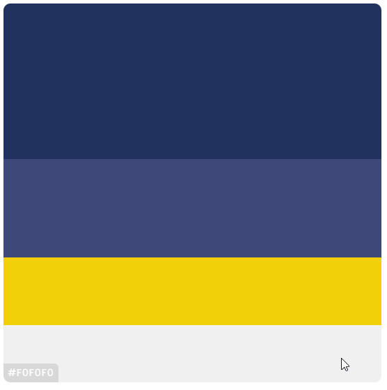

# 📼 Videateca - Quality entertainement Database

Videoteca is a place for wanderers looking for a new piece of entertainement. We support Movies, series and most importantly anime. 

## 📝 Exercise Description

*In this exercise we were supposed to create an online platform where people could come and have fun, we decided to make a website where people who don't know what to watch can look for something that will satisfy their entertainment needs*

[read more](https://github.com/becodeorg/gnt-verou-3/tree/main/2.The-Hill/05.End-with-a-bang)

 

## 🌠 Styling

For the styling we decided to go with something dark because you movies are always better when you watch it in the dark right?  
We wen't with a style that resembles IKEA but a little more on the dark side:

 

 

For the font we used[Montserrat](https://fonts.google.com/specimen/Montserrat). It's a modern font that looks nice on any browser.

 

## 🌠 Pages

